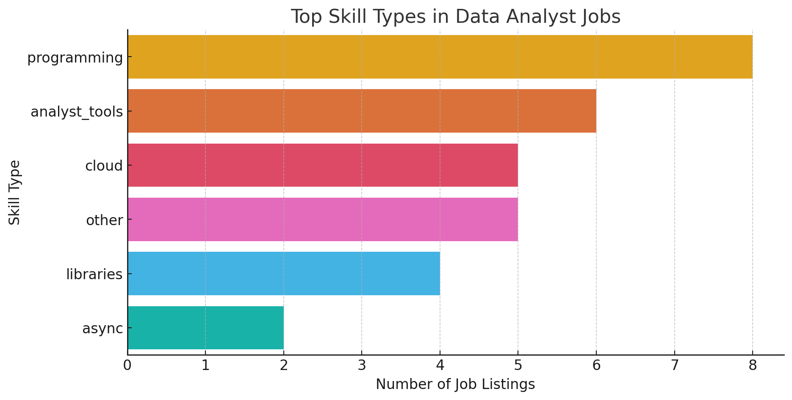

# SQL Data Analysis Project

## Introduction
📊 Dive into the data job market! Focusing on data analyst roles, this project explores 💰 top-paying jobs, 🔥 in-demand skills, and 📈 where high demand meets high salary in data analytics.

### The questions I wanted to answer through my SQL queries were:

1. What are the top-paying data analyst jobs?
2. What skills are required for these top-paying jobs?
3. What skills are most in demand for data analysts?
4. Which skills are associated with higher salaries?
5. What are the most optimal skills to learn?

# Tools I Used
For my deep dive into the data analyst job market, I harnessed the power of several key tools:

- **SQL:** The backbone of my analysis, allowing me to query the database and unearth critical insights.
- **PostgreSQL:** The chosen database management system, ideal for handling the job posting data.
- **Visual Studio Code:** My go-to for database management and executing SQL queries.
- **Git & GitHub:** Essential for version control and sharing my SQL scripts and analysis, ensuring collaboration and project tracking.

# The Analysis
Each query for this project aimed at investigating specific aspects of the data analyst job market. Here’s how I approached each question:

### 1. Top Paying Data Analyst Jobs
To identify the highest-paying roles, I filtered data analyst positions by average yearly salary and location, focusing on remote jobs. This query highlights the high paying opportunities in the field.

```sql
SELECT 
    job_id,
    job_title,
    job_location,
    salary_year_avg,
    job_posted_date,
    name as company_name
FROM 
    job_postings_fact
LEFT JOIN 
    company_dim ON
    job_postings_fact.company_id = company_dim.company_id
WHERE 
    job_location = 'Anywhere' AND 
    job_title_short = 'Data Analyst'  AND
    salary_year_avg IS NOT NULL
ORDER BY 
    salary_year_avg DESC
LIMIT 
    10
;
```

Here's the breakdown of the top data analyst jobs:
- **Wide Salary Range:** Top 10 paying data analyst roles span from $184,000 to $650,000, indicating significant salary potential in the field.
- **Diverse Employers:** Companies like SmartAsset, Meta, and AT&T are among those offering high salaries, showing a broad interest across different industries.
- **Job Title Variety:** There's a high diversity in job titles, from Data Analyst to Director of Analytics, reflecting varied roles and specializations within data analytics.


*Bar graph visualizing the salary for the top 10 salaries for data analysts; Generated with Python from my dataset.*

### 2. Skills for Top Paying Jobs
To understand what skills are required for the top-paying jobs, I joined the job postings with the skills data, providing insights into what employers value for high-compensation roles.

```sql
WITH top_paying_jobs AS (
    SELECT	
        job_id,
        job_title,
        salary_year_avg,
        name AS company_name
    FROM
        job_postings_fact
    LEFT JOIN company_dim ON job_postings_fact.company_id = company_dim.company_id
    WHERE
        job_title_short = 'Data Analyst' AND 
        job_location = 'Anywhere' AND 
        salary_year_avg IS NOT NULL
    ORDER BY
        salary_year_avg DESC
    LIMIT 10
)

SELECT 
    top_paying_jobs.*,
    skills
FROM top_paying_jobs
INNER JOIN skills_job_dim ON top_paying_jobs.job_id = skills_job_dim.job_id
INNER JOIN skills_dim ON skills_job_dim.skill_id = skills_dim.skill_id
ORDER BY
    salary_year_avg DESC;
```
Here's the breakdown of the most demanded skills for the top 10 highest paying data analyst jobs:
- **SQL** is leading with a bold count of 7.
- **Python** follows closely with a bold count of 6.
- **R** is also highly sought after, with a bold count of 4.
Other skills like **Pandas**, **Snowflake**, **Aws**, and **Azure** show varying degrees of demand.


*Bar graph visualizing the number of job listings for the top 10 paying skills for data analysts; Generated with Python from my dataset.*

Here's the breakdown of the most in-demand skill types for the top 10 highest paying data analyst jobs in 2023:
- **Programming** takes the lead, appearing in the majority of job postings.
- **Analyst Tools** follow closely, emphasizing the importance of data manipulation and visualization.
- **Cloud Technologies** are highly valued, showcasing the increasing reliance on cloud-based data infrastructure. Other skill types like Libraries, Other Technologies, and Async demonstrate varying levels of demand in the field.


*Bar graph visualizing the number of job listings for the most common skill types in data analyst roles; Generated with Python from my dataset.*

### 3. In-Demand Skills for Data Analysts

This query helped identify the skills most frequently requested in job postings, directing focus to areas with high demand.

```sql
SELECT 
    s.skills,
    COUNT(sj.job_id) AS demand_count
FROM
    job_postings_fact jp
INNER JOIN
    skills_job_dim sj ON 
    jp.job_id = sj.job_id
INNER JOIN
    skills_dim s ON 
    sj.skill_id = s.skill_id
WHERE 
    job_title_short = 'Data Analyst'
GROUP BY
    s.skills
ORDER BY
    demand_count DESC
LIMIT   
    10
;
```
Here's the breakdown of the most demanded skills for top paying data analysts in 2023
- **SQL** and **Excel** remain fundamental, emphasizing the need for strong foundational skills in data processing and spreadsheet manipulation.
- **Programming** and **Visualization Tools** like **Python**, **Tableau**, and **Power BI** are essential, pointing towards the increasing importance of technical skills in data storytelling and decision support.

| Skills     | Demand Count |
|------------|--------------|
| SQL        | 92628        |
| Excel      | 67031        |
| Python     | 57326        |
| Tableau    | 46554        |
| Power Bi   | 39468        |
| R          | 30075        |
| Sas        | 28068        |
| Powerpoint | 13848        |
| Word       | 13591        |
| Sap        | 11297        |

*Table of the demand for the top 10 skills in data analyst job postings*


### 4. Skills Based on Salary
Exploring the average salaries associated with different skills revealed which skills are the highest paying.
```sql
SELECT 
    s.skills,
    ROUND(AVG(salary_year_avg), 0) AS avg_salary
FROM
    job_postings_fact jp
INNER JOIN
    skills_job_dim sj ON jp.job_id = sj.job_id
INNER JOIN
    skills_dim s ON sj.skill_id = s.skill_id
WHERE 
    job_title_short = 'Data Analyst' AND
    salary_year_avg IS NOT NULL
GROUP BY
    s.skills
ORDER BY
    avg_salary DESC
LIMIT   
    10
;
```

| Skills        | Average Salary ($) |
|--------------|-------------------:|
| svn          |            400,000 |
| solidity     |            179,000 |
| couchbase    |            160,515 |
| datarobot    |            155,486 |
| golang       |            155,000 |
| mxnet        |            149,000 |
| dplyr        |            147,633 |
| vmware       |            147,500 |
| terraform    |            146,734 |
| twilio       |            138,500 |

*Table of the average salary for the top 10 paying skills for data analysts*

⚠️ Caution: While this analysis provides valuable insights into the highest-paying skills, it’s essential to interpret the findings carefully. 📊 A small sample size can lead to skewed results, making certain skills appear disproportionately lucrative due to a few high-paying job listings rather than reflecting broader industry trends.

🔍 To gain a more accurate understanding, these figures should ideally be compared with larger datasets and cross-referenced with industry-wide salary reports.

### 5. Most Optimal Skills to Learn

This SQL query retrieves the top 100 most in-demand skills for Data Analyst positions, along with their average salaries, and ranks them by salary.

```sql
WITH top_demanded_jobs AS ( 
    SELECT 
        s.skills,
        COUNT(sj.job_id) AS demand_count
    FROM
        job_postings_fact jp
    INNER JOIN
        skills_job_dim sj ON jp.job_id = sj.job_id
    INNER JOIN
        skills_dim s ON sj.skill_id = s.skill_id
    WHERE 
        job_title_short = 'Data Analyst'
    GROUP BY
        s.skills
    ORDER BY
        demand_count DESC
    LIMIT   
        100
), top_demanded_skills AS (
    SELECT 
        s.skills,
        ROUND(AVG(salary_year_avg), 0) AS avg_salary
    FROM
        job_postings_fact jp
    INNER JOIN
        skills_job_dim sj ON jp.job_id = sj.job_id
    INNER JOIN
        skills_dim s ON sj.skill_id = s.skill_id
    WHERE 
        job_title_short = 'Data Analyst' AND
        salary_year_avg IS NOT NULL
    GROUP BY
        s.skills
    ORDER BY
        avg_salary DESC
    LIMIT   
        100
)
SELECT 
    top_demanded_jobs.skills,
    top_demanded_jobs.demand_count,
    top_demanded_skills.avg_salary
FROM
    top_demanded_jobs
INNER JOIN
    top_demanded_skills ON top_demanded_jobs.skills = top_demanded_skills.skills
ORDER BY
    top_demanded_skills.avg_salary DESC
;
```
#### 📊 What This Query Achieves

* ✅ Finds the most in-demand skills for Data Analyst roles.
* ✅ Finds the highest-paying skills for Data Analyst roles.
* ✅ Combines both insights, listing skills that are both highly demanded and well-paying.
* ✅ Ranks the results by salary, so the most lucrative skills appear at the top.

#### 🔥 Practical Use Case

* Helps job seekers prioritize which skills to learn based on both demand and salary potential.
* Aids hiring managers in understanding which skills are most competitive in the market.
* Useful for salary negotiations, as it highlights which skills can command higher pay.

#### 📊 Key Takeaways from the Weighted Salary Analysis
* 1️⃣ *Programming Languages Lead the Market*

    Python and R stand at the top, reinforcing their dominance in data science, machine learning, and software development.
    Their combination of high salaries and widespread demand makes them some of the most strategic skills to learn.

* 2️⃣ *Cloud & Database Technologies are High-Value Investments*

    Azure, Oracle, and AWS rank highly, underscoring the growing reliance on cloud computing, database management, and enterprise solutions.
    Organizations are increasingly migrating to cloud-based infrastructures, making these skills essential for tech professionals.

* 3️⃣ *Data & Analytics Tools Remain in High Demand*


#### ⚖️ Why Weighted Salary is a Better Indicator of Skill Value

A raw salary ranking alone could be misleading, as it might highlight niche skills with high pay but limited job opportunities. However, a weighted approach accounts for both:
* ✅ **Earning potential** – How much companies are willing to pay for a skill.
* ✅ **Market demand** – How often these skills appear in job listings.

By balancing these factors, the ranking reflects the best skills to invest in—not only offering high salaries but also ensuring strong job prospects.
⚠️ Limitations & Considerations

While this method enhances accuracy, it's important to interpret the results within a broader industry context:
* 📉 **Rapid tech evolution** – Some high-demand skills may shift as new technologies emerge.
* 📊 **Dataset scope** – A larger dataset across multiple industries would further refine these insights.
* 🛠 **Industry specialization** – The best skill for you depends on your specific career path (e.g., AI, DevOps, Cloud, etc.).
## 🚀 *Final Thoughts*

This analysis provides a roadmap for skill development, highlighting which technologies are both lucrative and in high demand. For professionals and learners, mastering these skills can lead to high-paying roles and strong career stability in today’s evolving tech landscape.